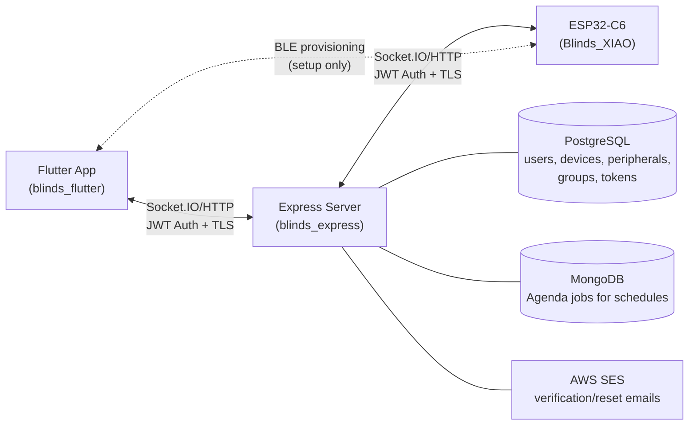

## BlindMaster Project

BlindMaster is a **full-stack IoT smart blinds control system** consisting of three sub-projects: a Node.js backend, a Flutter mobile app, and ESP32-C6 microcontroller firmware. Together they enable users to remotely control, schedule, and calibrate motorized window blinds.

---

### 1. `blinds_express` — Node.js Backend Server

**Technologies:** Express.js, Socket.IO, PostgreSQL (via `pg`), MongoDB (via Mongoose + Agenda), JWT authentication, Argon2 password hashing, Nodemailer + AWS SES, rate-limiter-flexible, cron-parser

**Core Functionality:**
- **Authentication & User Management** — Full user lifecycle: registration (`/create_user`), login with JWT tokens (5-day expiry), email verification (via AWS SES with branded HTML emails), password reset with 6-digit codes, password change, email change with re-verification, account deletion, logout. Unverified users are auto-deleted via scheduled Agenda jobs.
- **Device & Peripheral Management** — CRUD operations for devices (physical ESP32 hubs) and peripherals (individual blinds on a device). Endpoints for adding, renaming, deleting devices/peripherals, listing them, and checking connection status.
- **Groups** — Peripherals can be grouped for batch control. Endpoints: `/add_group`, `/delete_group`, `/group_details`, `/group_list`, `/update_group`, `/rename_group`, and group-level position updates.
- **Real-time Communication (Socket.IO)** — Bidirectional WebSocket communication between the server, mobile app, and ESP32 devices. Key events:
  - **Calibration flow**: Multi-stage handshake (`calib_start` → `calib_stage1_ready` → `user_stage1_complete` → `calib_stage2_ready` → `user_stage2_complete` → `calib_done`) relayed between device and user app via the server.
  - **Position updates**: `posUpdates` events pushed to devices and user apps in real-time.
  - **Connection tracking**: `device_init` on authentication, `report_calib_status` for device state, `pos_hit` for position confirmations.
  - Both user and device sockets are distinguished by JWT payload `type` field (`"user"` vs `"peripheral"`).
- **Scheduling (Agenda + MongoDB)** — Cron-based scheduling for automated blind position changes. Job types: `posChange`, `posChangeScheduled`, `groupPosChangeScheduled`, `calib`, `cancel_calib`, `deleteUnverifiedUser`, `deletePasswordResetToken`, `deleteUserPendingEmail`. Schedules can be created, updated, and deleted per-peripheral or per-group.
- **Security** — Multiple rate limiters (HTTP: 5/sec, auth: 10/hour, WS connections: 5/sec, WS messages: 5/sec, email resend: 1/20sec, password reset: 10/15min). JWT-based auth for both HTTP and WebSocket. On startup, all stale connection states and expired tokens are cleaned.

**Architecture:** Event-driven real-time architecture. The server acts as a central relay between the mobile app and IoT devices, forwarding calibration commands and position changes via Socket.IO while persisting state in PostgreSQL and scheduling in MongoDB.

---

### 2. `blinds_flutter` — Flutter Mobile App

**Technologies:** Flutter/Dart, Material Design 3, Socket.IO client, HTTP, Flutter Secure Storage, Google Fonts

**Core Functionality:**
- **Time-based Theming** — Primary color changes based on time of day: orange (5–10am), blue (10am–6pm), purple (evening/night). Applied consistently across the app and email templates.
- **Authentication Flow** — Splash screen → Login/Register → Email verification waiting screen → Home. JWT tokens stored in Flutter Secure Storage.
- **Home Screen** — Bottom navigation with tabs: individual device control (`devices_menu`), group control (`groups_menu`), and account management. Personalized greeting with user's name fetched from the backend.
- **Device/Peripheral Control** — Visual `BlindControlWidget` with an image of blinds overlaid with animated brown slat bars. A vertical slider (0–10 range, 11 discrete positions) controls blind position:
  - Positions 0–4: closed-to-open downward
  - Position 5: fully open
  - Positions 6–10: open-to-closed upward
- **Scheduling UI** — Per-peripheral and per-group schedule management. Users can view, add, edit, and delete schedules via a day/time picker. Schedules display translated position labels (e.g., "Close (down)", "Open", "Open (up)").
- **Account Management Screens** — [account_screen.dart](blinds_flutter/lib/BlindMasterScreens/accountManagement/account_screen.dart), [change_email_screen.dart](blinds_flutter/lib/BlindMasterScreens/accountManagement/change_email_screen.dart), [change_password_screen.dart](blinds_flutter/lib/BlindMasterScreens/accountManagement/change_password_screen.dart), [verify_email_change_screen.dart](blinds_flutter/lib/BlindMasterScreens/accountManagement/verify_email_change_screen.dart).
- **Network Layer** ([secure_transmissions.dart](blinds_flutter/lib/BlindMasterResources/secure_transmissions.dart)) — Centralized HTTP helpers (`secureGet`, `securePost`, `secureDelete`, `regularGet`, `regularPost`) and a `connectSocket()` function. All secure calls attach JWTs from secure storage. Built-in retry-on-429 logic. Production server: `https://wahwa.com`; local dev toggle available.

**Architecture:** Standard Flutter stateful widget pattern. Centralized HTTP/WebSocket layer. Navigation is screen-based (push/replace). Real-time updates via Socket.IO for live blind position changes and calibration status.

---

### 3. `Blinds_XIAO` — ESP32-C6 Firmware (ESP-IDF)

**Technologies:** ESP-IDF (C/C++), FreeRTOS, NimBLE (Bluetooth Low Energy), ESP WiFi, Socket.IO client (native), LEDC (PWM for servo), Rotary Encoders, NVS (Non-Volatile Storage), I2C (MAX17048 fuel gauge), cJSON

**Core Functionality:**
- **Servo Motor Control** — Continuous-rotation servo driven via LEDC PWM at 50Hz. Three duty values: `cwSpeed` (3300 = clockwise), `ccwSpeed` (6500 = counter-clockwise), `offSpeed` (4900 = stop). A GPIO switch controls servo power for battery savings. Position mapped to 0–10 app positions via encoder tick counting.
- **Rotary Encoder Input** — Two encoder instances: `topEnc` (output shaft encoder for position tracking) and `bottomEnc` (manual input encoder, e.g., blind wand). Used for both calibration and position sensing.
- **BLE Provisioning** — NimBLE server (`BlindMaster-C6`) with service UUID `181C` and characteristics:
  - `0x0000`: SSID list (READ) — scanned Wi-Fi networks
  - `0x0001`: Credentials JSON (WRITE) — `{"ssid":"...","password":"..."}`
  - `0x0002`: Token (WRITE) — JWT auth token from backend
  - `0x0003`: Auth confirmation (READ + NOTIFY) — result feedback
  - `0x0004`: SSID refresh (WRITE + READ + NOTIFY)
  - `0x0005`: Device info (READ)
  - Secure Connections (LE SC) enabled, no MITM, no bonding.
- **Wi-Fi Management** — Full ESP-IDF STA (station) mode with comprehensive disconnect reason handling (wrong password, SSID not found, AP busy, etc.). Credentials stored in NVS. Supports DHCP renewal fallback. Event-driven with FreeRTOS event groups for connect/scan signaling.
- **Socket.IO Communication** — Native ESP Socket.IO client connects to the backend (`wahwa.com` over TLS). Handles events: `device_init` (auth handshake), `posUpdates` (receive position commands), `calib_start`/`cancel_calib`, and `error`. Periodic position polling via HTTP fallback when Socket.IO is inactive.
- **Calibration System** — Multi-stage calibration process:
  1. Device records "up" tick count from encoder
  2. User physically moves blind to bottom → records "down" ticks
  3. Calibration values saved in NVS for tick-to-position mapping
  4. State machine coordinated via Socket.IO with server relay
- **Battery Management** — I2C MAX17048 fuel gauge for LiPo battery monitoring. Reads SoC (state of charge) and voltage, posts events to ESP event loop. Low-battery warnings at <20%.
- **Power Management** — ESP-IDF power management with dynamic frequency scaling (80–160MHz) and light sleep enabled during idle. Servo power switch controlled via GPIO to minimize drain.
- **Main Event Loop** — FreeRTOS queue-based event loop. A `wakeTimer` task fires every 60 seconds to poll position via HTTP if Socket.IO is inactive. Events: `EVENT_REQUEST_POS` triggers HTTP GET for latest position. Fallback to full `setupAndCalibrate()` on persistent failures.
- **Persistent State (NVS)** — Stores: Wi-Fi credentials (`WiFiCreds`), auth token (`AUTH`), calibration data (`CALIB` — UpTicks, DownTicks, status), servo position (`SERVO`).

**Architecture:** FreeRTOS task-based with event queues. BLE provisioning bootstraps Wi-Fi, which enables Socket.IO real-time communication with the server. The main event loop coordinates servo control, encoder reading, calibration flow, and network communication. Hardware abstraction via dedicated modules (`servo.cpp`, `encoder.cpp`, `WiFi.cpp`, `BLE.cpp`, `calibration.cpp`, `batteryManagement.cpp`).

---

### Cross-Project Architecture

**Key Patterns:**
- **Server as relay** — The Express server mediates all communication between app and device, never direct app-to-device communication after provisioning.
- **Dual-path position updates** — Socket.IO for real-time; HTTP polling as fallback when sockets are down.
- **BLE-only provisioning** — Initial device setup (Wi-Fi creds + auth token) happens over BLE directly between phone and ESP32, bypassing the server.
- **Consistent 0–10 position model** — The 11-position blind state is shared across all three codebases. Position 5 = open; 0/10 = closed (from opposite directions).

## Upcoming
- Once BMS system is developed on taskdrivenpowersave branch, this will replace main and the project may be released.
- Will release app on testflight and hardware designs will be open-sourced.